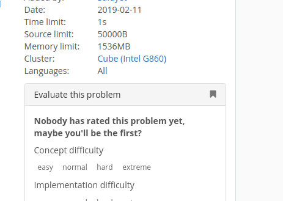
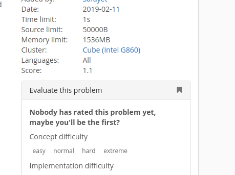

## SPOJ Score Display

A chrome extension that displays score of a problem on [SPOJ](https://www.spoj.com).

### Why ?

SPOJ has over 20,000 problems. Usually, to know the score of a problem, you need to find that problem in the [problems](https://www.spoj.com/problems/classical/) page and hover on the 'users' column. Here is a chrome extension that displays score on the problem page itself.

### Normally: 

### With Extension:

